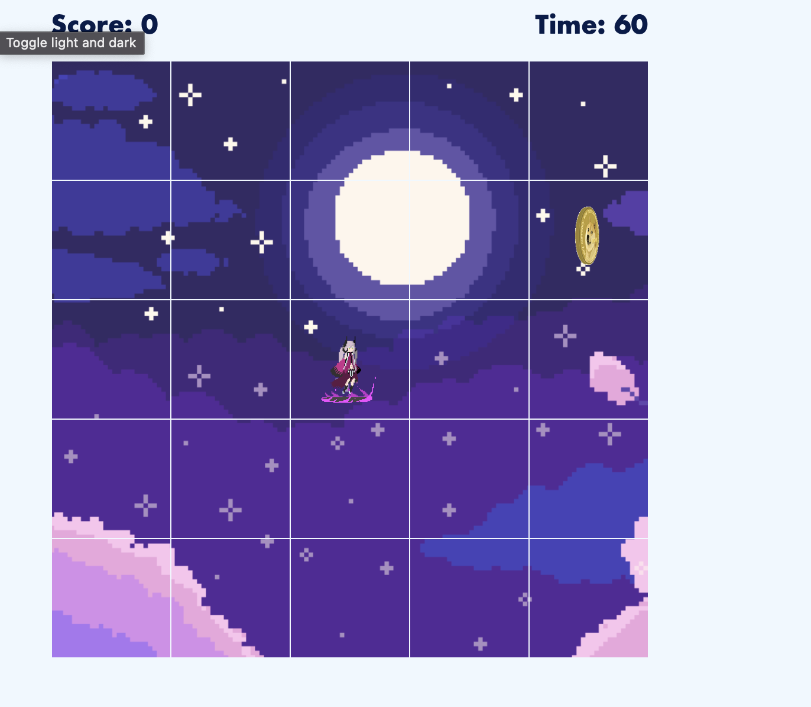

# DOGE Mage


##  Tests and Deploy statuses
[](https://github.com/FominSergiy/dogeMage/actions/workflows/run-unit-tests.yml)
[](https://github.com/FominSergiy/dogeMage/actions/workflows/deploy-to-gf-pages.yml)

## A little bit about the project

This project was created as a React/Redux practice. I took a fun twist on it (still while DOGE was popular). Feel free to set up a new score!

This project is setup with automated tests and build process. Althought unit tests don't come even close to covering all the components / functionality, they are good enough to setup workflows (all in the name of the automation).

The game is sort of available for desktop and mobile




## Requirements
- [Node](https://nodejs.org/en/download/) v14.17.4
- [Npm](https://docs.npmjs.com/downloading-and-installing-node-js-and-npm) v6.14.14


## Setup

> Reach out to me if you would like to work on this project. There are secrets to be shared!

### Node install

> suggest going the nvm route
- [Mac](https://tecadmin.net/install-nvm-macos-with-homebrew/)

### Run Npm

First thing you would need to do is to get all the `node_modules` in your local project. From your cloned repo run: ( replace npm with yarn if that's what applies to you)

```
$ npm install
```

that will get all the modules needed for the app to run. Once all set, run the following command to check out the game locally.

```
$ npm start
```

From this point feel free to experiment with the code.

## Tests

```
npm run unit-test
```

## Build the App
> There is a workflow setup to do the build. All you need is to get your PR approved / pushed to master

## Deployed App

https://fominsergiy.github.io/dogeMage/